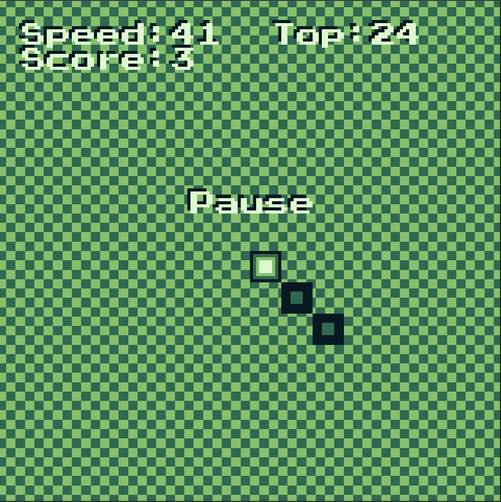

# Snake4W


\
This is a simple snake game written in AssemblyScript for the [WASM-4](https://wasm4.org) fantasy console.

## Building

First setup the project by running:

```shell
pnpm install
```

Build the cart by running:

```shell
pnpm run build
```

Then run it with:

```shell
w4 run build/cart.wasm
```

To ease development, use it with:

```shell
w4 watch
```